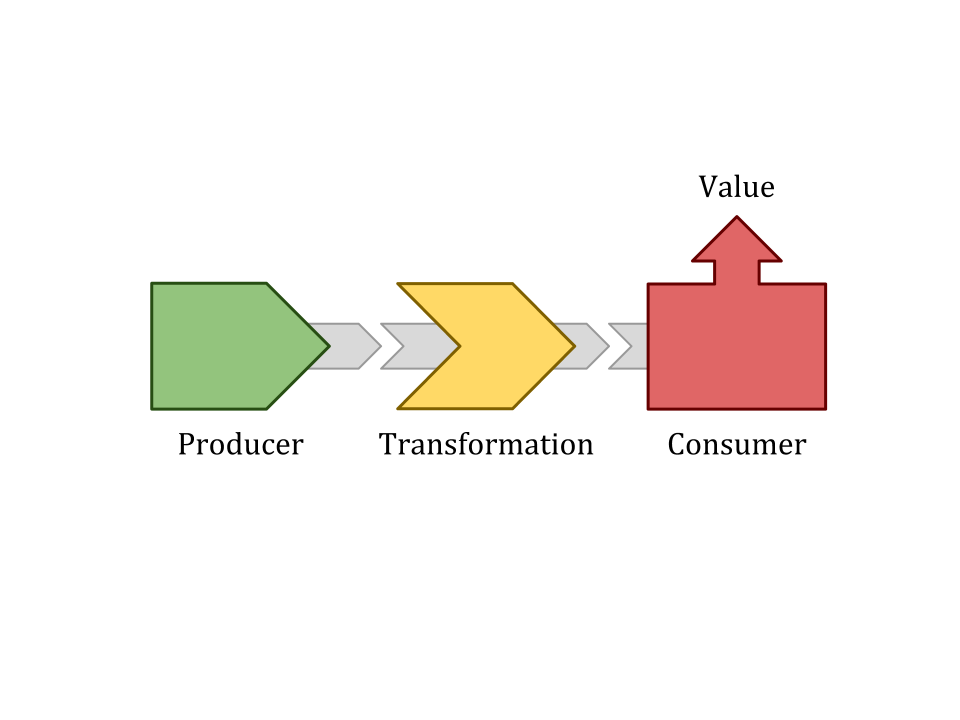
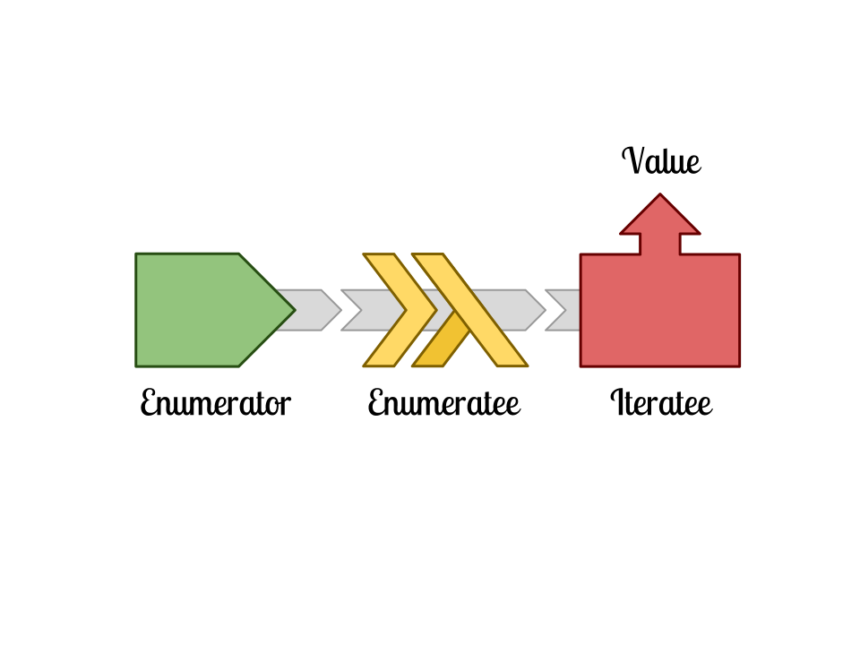

# Iteratee

> Iteratees are an abstraction discovered
> by Oleg Kiselyov, which provide a performant,
> predictable, and safe alternative to lazy I/O.
>
> -- [John Millikin](https://john-millikin.com/articles/understanding-iteratees/)

# Rationale

How is lazy/monadic I/O not **performant**, **predictable** or **safe**?

~~~~ {.haskell}
wrong = do
	fileData <- withFile "test.text" ReadMode hGetContents
	putStr fileData
~~~~

# Rationale

How is lazy/monadic I/O not **performant**, **predictable** or **safe**?

~~~~ {.haskell}
right = withFile "test.txt" ReadMode $ \handle -> do
  fileData <- hGetContents handle
  putStr fileData
~~~~

# Intuition

# Intuition

# Intuition

# Haskell (Oleg)

~~~~ {.haskell}
-- module Iteratee where

data Chunk a
  = Chunk [a]
  | EOF
  deriving (Show, Eq)

data Step e a m b
  = Continue (Chunk a -> Iteratee e a m b)
  | Yield b (Chunk a)
  | Error e

newtype Iteratee e a m b = Iteratee {
  runIteratee :: m (Step e a m b)
}
~~~~

# Example (count spaces)

~~~~ {.haskell}
countSpaces :: Monad m => Iteratee Char m Int
countSpaces = loop 0
  where loop n = getchar >>= check n
        check n Nothing = return n
        check n (Just c) = loop (if isSpace c then n + 1 else n)

runCountSpaces fileName = print =<< run =<< enum_file fileName countSpaces
~~~~

# Same thing (handle IO)

~~~~ {.haskell}
countSpaces :: Handle -> IO Int
countSpaces handle = loop 0
  where loop n = try (hGetChar handle) >>= check n
        check n (Right c) = loop (if isSpace c then n + 1 else n)
        check n (Left e) | Just ioe <- fromException e,
                           isEOFError ioe = return n
        check _ (Left e) = throw e
        
runCountSpaces fileName =
  bracket (openFile fileName ReadMode) hClose $ \handle ->
    countSpaces handle >>= print
~~~~

# Same thing (lazy IO)

~~~~ {.haskell}
countSpaces :: String -> Int
countSpaces "" = 0
countSpaces (c:cs) | isSpace c = 1 + countSpaces cs
countSpaces (_:cs) = countSpaces cs
~~~~

# But we can do better with lazy I/O

~~~~ {.haskell}
countSpaces :: String -> Int
countSpaces = length . filter isSpace
~~~~

# Well, we also can with iteratees
~~~~ {.haskell}
countSpaces :: Monad m => Iteratee Char m Int
countSpaces = id .| (en_filter isSpace) count_i
~~~~

# Iteratee interface

~~~~ {.haskell}
type Iteratee el m a

instance Monad m => Monad (Iteratee el m)

instance MonadTrans => (Iteratee el)

getchar :: Monad m => Iteratee el m (Maybe el)  -- IO.getChar, List.head

count_i :: Monad m => Iteratee el m Int  -- List.length

run :: Monad m => Iteratee el m a -> m a
~~~~

# Enumerator interface

~~~~ {.haskell}
type Enumerator el m a =
  Iteratee el m a -> m (Iteratee el m a)

enum_file :: FilePath -> Enumerator Char IO a
~~~~

# Enumeratee inferface

~~~~ {.haskell}
type Enumeratee elo eli m a =
  Iteratee eli m a -> Iteratee elo m (Iteratee eli m a)

infixr 1 .|
(.|) :: Monad m => (Iteratee el m a -> w)
  -> Iteratee el m (Iteratee el' m a)
  -> w

en_filter :: Monad m => (el -> Bool) -> Enumeratee el el m a

take :: Monad m => Int -> Enumeratee el el m a  -- List.take

enum_words :: Monad m => Enumeratee Char String m a  -- List.words
~~~~

# Let's recall last example
~~~~ {.haskell}
countSpaces :: Monad m => Iteratee Char m Int
countSpaces = id .| (en_filter isSpace) count_i

runCountSpaces fileName = print =<< run =<< enum_file fileName countSpaces
~~~~

# How about counting spaces in many files?
~~~~ {.haskell}
countSpaces :: Monad m => Iteratee Char m Int
countSpaces = id .| (en_filter isSpace) count_i

runCountManySpaces fileNames =
  print =<< run =<< foldr (>>>) return (map enum_file fileNames) countSpaces
~~~~

# Let's see how we count occurrences of word " the "?
~~~~ {.haskell}
countThe :: Monad m => Iteratee Char m Int
countThe = id .| enum_words .| en_filter (== "the") count_i

runCountThe fileName =
  print =<< run =<< enum_file fileName countThe
~~~~

> Should have done Unix pipes in Haskell..
>
> -- Dennis Ritchie
